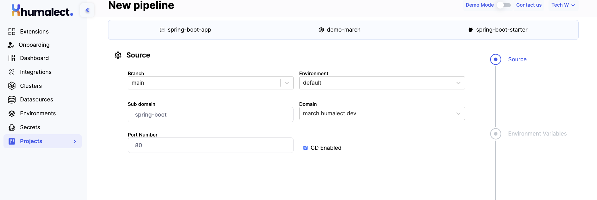
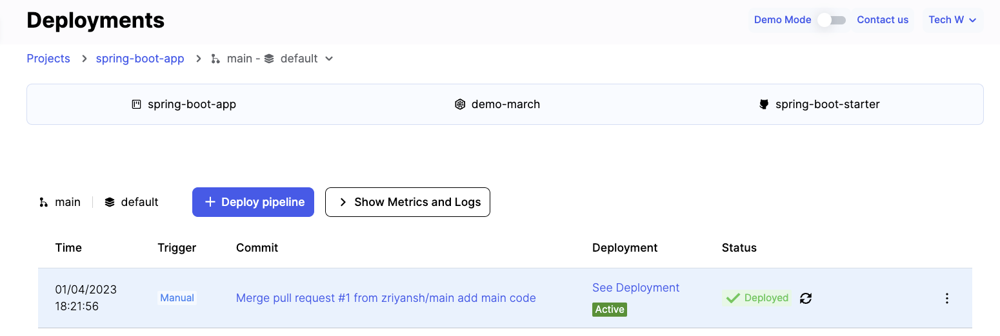
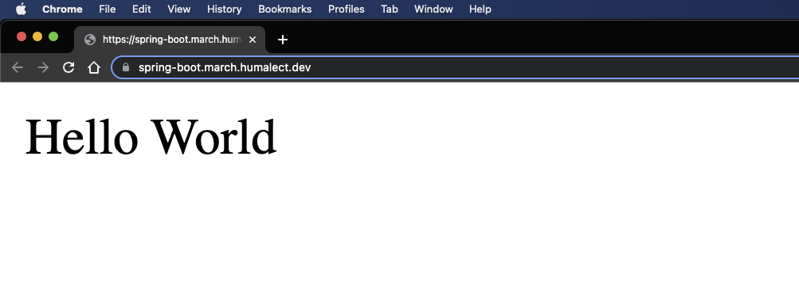

Spring Boot is a project that is built on the top of the Spring Framework. It provides an easier and faster way to set up, configure, and run both simple and web-based applications. It is a Spring module that provides the RAD (Rapid Application Development) feature to the Spring Framework. It is used to create a stand-alone Spring-based application that you can just run because it needs minimal Spring configuration.

In this tutorial, we will see how can we deploy a sample Spring Boot application in a few clicks using the Humalect platform.

<!--truncate-->

Let's get started!

### Example Spring Boot application 

Fork [THIS](https://github.com/Humalect/spring-boot-starter) sample Spring Boot repository to get started.

This Spring Boot application exposes a static API that return a static response and runs on port 8080.

### Humalect Account Setup

:::tip
Please skip to point 5 if you have setup your Humalect account and have a functional K8s cluster.
:::

1. **Sign up**: visit https://humalect.com and sign up. Complete the registration flow and log in.

2. **Integrate your Cloud Provider**: Connect AWS/Azure by visiting [THIS](https://console.humalect.com/user/integrations) link and following their respective workflows.

3. **Integrate your source code provider**: Visit [THIS](https://console.humalect.com/user/integrations) link, follow the respective workflow to connect Bitbucket/Github/GitLab.

4. **Create a Kubernetes Cluster**: Create a k8s cluster by referring to our [AWS](../Clusters/create-an-AWS-cluster) or [Azure](../Clusters/create-an-Azure-cluster) docs.

5. **Create an environment**

An environment is a logically isolated k8s namespace that contains all your deployment related entities for a pipeline.

Create an environment for your Spring Boot application. Check for various options that need to be configured to create a new environment or use an existing one.

:::info

These are some important fields:
- Name of the environment that you wish to created: can be dev, prod or test etc.
- Cluster in which you want to create this environment.
- The namespace in the k8s cluster that will host this environment.
:::

6. **Create a project**.

A project maps the cluster and the code repository which needs to be deployed.

Refer the image below for various options that need to be configured to create a project.

7. **Create a pipeline**.

After creating your project, let's now create a pipeline to define few of the below things for our deployment:

- The subdomain on which you need your deployment to go live.
- The port on which your code runs.
- The branch from your code repo that you want to deploy.
- The environment that you want to deploy to.
- Whether you want to enable continuous deployments.
- The environment variables for your app.

Refer the image below for various options that need to be configured to create a pipeline.

next,

***Advanced Options***:

- You can use the Dockerfile available in the git repo, check the box **use Docker from source code**.
- Leave the autogenerated k8s YAML files, you can edit them if you wish (this can break things, edit only if you are aware of consequences)

Refer the image below for advanced options related to a pipeline.

8. **Deploy pipeline**.

Once your pipeline is created, hit the **deploy pipeline** button to deploy your app.
If you have enabled continuous deployments while pipeline creation, all your future commits will be automatically deployed.

Refer image below for pipeline deployment.

9. **See that your app is live**.

Hit the **See Deployment** link next to your latest deployment and it will take you to the URL of your deployed application. The SSL certificates are auto-generated for you.

Refer image below for live deployment.

10. **Check logs and metrics**.

Hit the **Show Metrics and Logs** button to view happenings of your latest deployment.

Refer image below for live deployment logs and metrics.

We are done!

Happy deploying!

