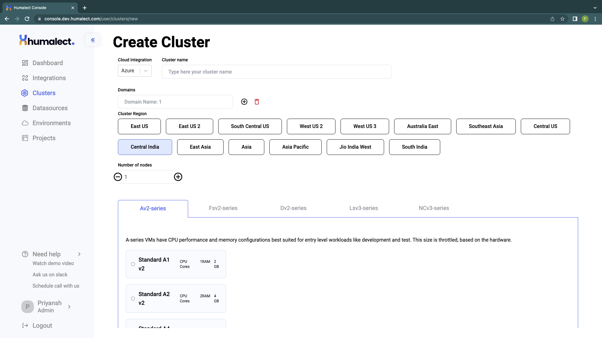
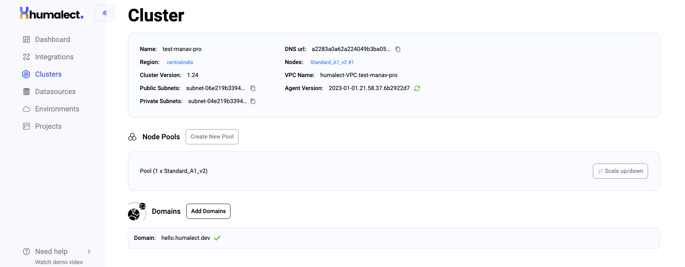

> ## This article covers:-
> *1. Introduction to Clusters*
> *2. Cluster Viewing options*
> *3. Create New Cluster*
> *4. Created Clusters*
> *5. Steps to Delete a Created Cluster*
> *6. Node Pools (disabled feature)*
> *7. Domains*

## Introduction to Clusters

In Kubernetes, a cluster is a set of machines, called nodes, that are used to run containerized applications. Each node in a Kubernetes cluster runs a container runtime, such as Docker, and is managed by the Kubernetes control plane. The control plane is responsible for scheduling and managing the containers that are running on the nodes.

A Kubernetes cluster typically includes at least one master node and one or more worker nodes. The master node runs the control plane components, such as the API server, etc, and the kube-scheduler. The worker nodes run the container runtime and the kubelet, which communicates with the control plane to ensure that the desired state of the containers is maintained.

The cluster can be spread across multiple availability zones, regions, or even cloud providers to achieve high availability, scalability, and fault tolerance. Kubernetes also provides features such as auto-scaling, self-healing, and rolling updates, which allow it to automatically manage the resources available in the cluster and ensure that the applications running on it are highly available and performant.

Humalect platform creates and uses managed kubernetes clusters like AWS EKS and Azure AKS provided by respective cloud providers.

## Getting started

The Clusters tab is present on the left sidebar, it helps you create new Clusters.

Use the `+ Create New Cluster` button in the top right corner to create or import new clusters.

We have set up 2 clusters below for reference.

> You can also **import the cluster** by clicking on the drop-down menu of the `+ Create New Cluster`, situated at the right top.

## Cluster Viewing options
Humalect currently supports two types of Cluster Dashboard UI, they are:
**1. List view**
**2. Card view**

You can also select the next drop-down option to select:
**1. Created Cluster**
**2. Imported Cluster**
**3. Deleted Cluster**

## Create New Cluster

To create a new cluster, click on the `+ Create New Cluster` button situated at the top right side.
Humalect provide the following Cloud Integration options for now:
**1. Amazon Web Services (AWS)**
**2. Microsoft Azure**

Feel free to request the cloud provider of your choice and we'll try to integrate it.

Enter all the required details and hit create cluster. After you successfully create a cluster, you'll see a `Cluster creation in progress` bar, with a clickable button to see the Cluster creation `Logs`.

> **Next Steps:**
> **1. [Create AWS Cluster](https://docs.humalect.com/en/Cluster/cluster-aws)**
> **2. [Create Azure Cluster](https://docs.humalect.com/en/Cluster/cluster-azure)**

## Created Clusters

Each created cluster has the following details associated with it. Refer to the chart below for more information on the same.

Click on any of the clusters and you'll see a more detailed individual cluster view.

Refer to the table below for various fields and values associated with created clusters.

> | Name                  | Desc |
> | --------------------- | ---- |
> | **Name**                  | Name of the cluster    |
> | **Region**                | cloud provider region in which cluster is created     |
> | **cluster/cluster-delete**       | Kubernetes version of cluster.     |
> | **Public Subnets**        | Network segment that allows external access to the cluster's resources and services via a public IP address.     |
> | **Private Subnets**       | Network segment that is not publicly accessible and is used for internal communication between cluster nodes.|
> | **DNS URL**               | DNS URL for Load Balancer or CDN on which the domain is to be pointed     |
> | **Instance Size / Nodes** | Type of machine instance used to create the cluster     |
> | **VPC Name**              | Virtual Private Cloud Name    |
> | **Agent Version**         | Version of humalect agent that is being used by cluster     |
> | **Status**                | Depicts whether the cluster is healthy or not.     |

<i>Table showing Cluster details page values and their description. </i>

## Steps to Delete a Created Cluster
To delete a cluster,

**Step 1:** Go to the Clusters tab and identify the cluster which you wish to delete.
**Step 2:** From among the chosen cluster, click on the 3 dots that appear on the right side. A drop-down menu will open up with the following options as shown.

**Step 3:** If the option to delete the cluster is not available to you, there can be 2 reasons for it.
- You are **not** the admin. Only users with admin access can delete clusters.
- Enable cluster deletion from user settings. Refer [here.](https://docs.humalect.com/en/Admin)

**Step 4:** Once you click on the `Delete` option, cluster deletion will start, you can click on `logs` from the UI to see the same as shown in the figure below.

## Node Pools (disabled feature)

To create more Node Pools, click on the `Create New Pool`.

If you do not have any new pools created, it will show the default or existing pools e.g. `Pool(1 x Standard_A1_v2)`.

> **Note:** *You can also scale it up and down as per your desire.*

## Domains

Other than the domains that you provided during cluster creation, you can add more domains.

Select a cluster, Scroll down the cluster page, and you'll see a button `Add Domains`, click on it.

You can add multiple domain names (make sure to link them with your DNS provider), then click on `Add to cluster` and you are good to go.

If your domain is not verified, you'll see the following error message.

### Troubleshooting
Need help? [Contact](./../docs/Contact-us/reach-out-to-us) us
