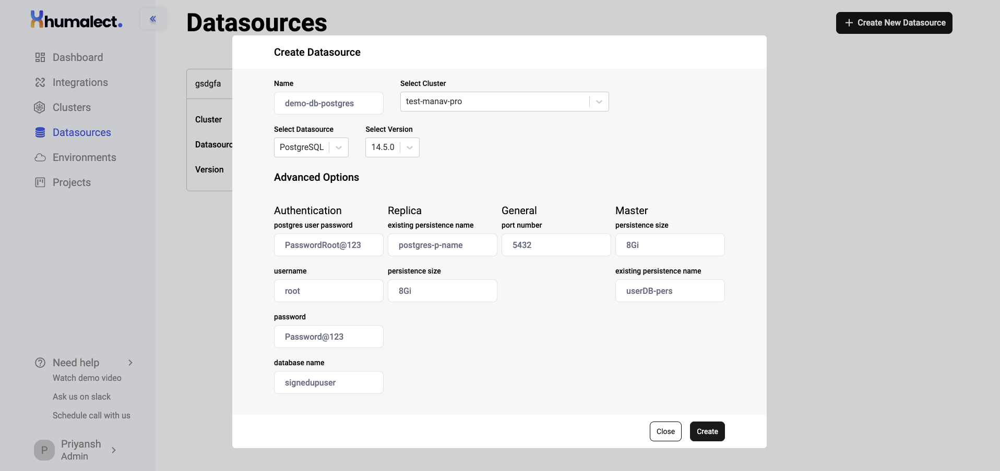
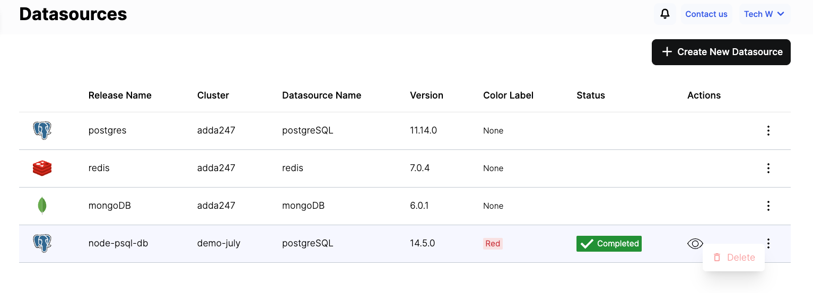

Humalect provides several databases that you can integrate and bring your data to the platform with minimal permissions from Humalect's side, in this article, we will be focusing on **Postgres**.

Postgres is a free and open-source *relational database* management system that is used for managing large amounts of structured data. It offers robust support for SQL, as well as several advanced features, including multi-version concurrency control, point-in-time recovery, and native replication.

:::info
For more information, see [Postgres Docs.](https://www.postgresql.org/docs/)
:::

## Prerequisites
1. Have a connected cloud provider
2. Have a connected source code provider
3. Have a cluster

## Create a Postgres Datasource

Let's create a Datasource with `Postgres version 14.5.0`

**Step 1:** Go to the DataSources Tab from the UI ([or click here to get redirected](https://console.humalect.com/user/datasources)) and click on `+ Create New Datasource.`

**Step 2:** Enter the following details:

> | Field | Desc |
> | -- | -- |
> | **Name** | name of your Datasource|
> | **Select Cluster** | cluster name where you want your Datasource to be created |
> | **Select DataSource** | choose database/cache of your choice|
> | **Select Version** | `v14.5.0`, `v11.14.0` ([click for more details on Postgres versions](https://www.postgresql.org/docs/release/))|
> | **Select Color Label**| choose b/w RED, GREEN, BLUE| 

**Step 3:** After you enter the above details, you'll be prompted to enter additional details such as `persistence size`, `port number`, etc. Refer to the below table for more information.

### Postgres Advanced Options

Under the `Advanced Options`, enter the following details:

| Authentication | Desc | | General | Desc |
| ---------------------- | ---- | -- | ----------- | ---- |
| **postgres user password** | PostgreSQL password for the `postgres` user when the username is not postgres | | **port number** | The default port for Postgres is 5432, but it can be configured to listen on a different port using this setting. | |
| **username** | PostgreSQL username. default value if `postgres` | | | |
| **password** | PostgreSQL password | | | |
| **database name** | PostgreSQL database | | | |

| Value | Master | Replica | Desc |
| ------------------------- | ------ | ------- | ---- |
| **persistence size** | 8Gi* | 8Gi* | This is a measure of size of a Postgres database and can vary depending on the amount and type of data stored, as well as the configuration of the Postgres instance. |
| **existing persistence name** | - | - | If you already have previous persistent volume claim and want to reuse it, you directly attach it using this setting. |

`*default value`

**Step:4** After you successfully fill in all the required details, click on `Create` and the Datasource creation process will start.

<i>Picture representing the state of UI when all the details are entered.</i>

**Step 5:** Once the Postgres Datasource is successfully created, you'll see them listed in the DataSources tab with details like:

- Release Name - User entered name
- Related Cluster Name - The name of cluster which hosts the datasource
- Datasource name - [Redis | MongoDB | PostgreSQL | MySQL ]
- Database version used
- Color Label
- Status - Datasource creation Completed or Failed. 
- Action - To fetch Datasource credentials

**Step 6:** If you wish to **delete** the datasource, click on the vertical 3 dots next to the datasource card and click on `Delete`. This will initiate the deletion process.

:::caution
Do not delete any datasource if you are not sure about it as it can lead to dataloss.
:::

## How to use existing datasources in a pipeline?
TBD

### Troubleshooting
Need help? [Contact](./../Contact-us/reach-out-to-us) us

