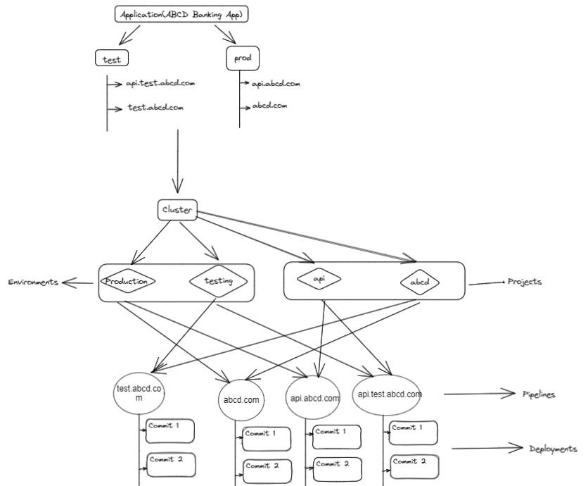

# Pipelines Overview
## What is Pipeline?

Pipeline is a logical entity, one level below the project. After selecting the cluster and the code repository on the project level, pipelines allow to select the environment and the git branch for the application deployment. In a pipeline, user can also enter the subdomain on which the application deployment is to be hosted. All the manifests like Dockerfiles, YAMLs and environment variables can be edited in a pipeline.

## Why Pipelines?
1. To support multiple environments and subdomains inside the same cluster, we need pipelines.
2. CI/CD is enabled on git repositories via pipelines.

Let us consider an example of an ABCD Banking App to understand the pipelines better.

1. `ABCD  Bank` has it's Banking App which needs to run a cluster via Humalect's console.

2. The app's cluster will host multiple environments and projects.
3. In this case, there are two running environments, i.e. test/testing and prod.
4. There are two projects present in the cluster i.e. `api` and `abcd`.
5. Each project has two pipelines, one for each environment.
6. Each pipeline has multiple associated deployments

## Creating a Pipeline?
To know how to create a pipeline in Humalect's console's dashboard, visit [Create Pipeline](create-a-pipeline).

## Updating a Pipeline?
To know how to update a pipeline in Humalect's console's dashboard, visit [Update Pipeline](./editing-existing-pipeline).

## Deleting a Pipeline?
To know how to delete a pipeline in Humalect's console's dashboard, visit [Delete Pipeline](./delete-a-pipeline).

### Troubleshooting
Need help? [Contact](./../Contact-us/reach-out-to-us) us
