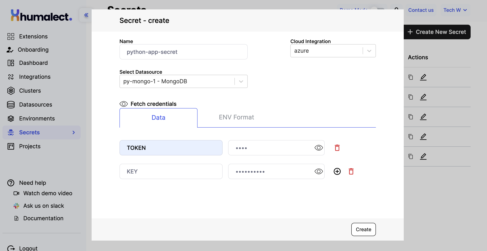
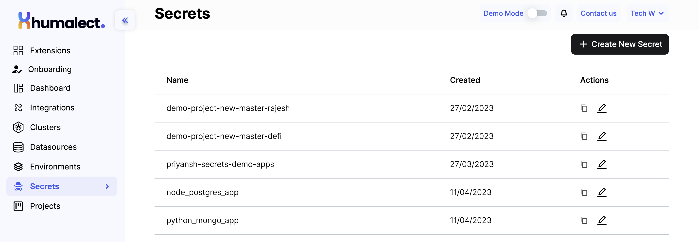

Humalect comes with a new feature called "Secrets" which allows users to store their environment variables and in their own cloud inside the Kubernetes cluster. In this documentation, we will discuss the features of Humalect's Secrets and how to use them effectively.

## Features of Secrets:

1. **Secure storage:** Secrets in Humalect are stored securely in your own cloud, so you can be assured that your sensitive information is safe from unauthorized access.
2. **Easy management:** With Humalect's Secrets feature, managing your environment variables has never been easier. You can easily store, update, and delete your secrets in a few clicks.
3. **Seamless integration:** Humalect's Secrets feature seamlessly integrates with Kubernetes, making it easy to deploy and manage your applications.

## Using Humalect's Secrets:

To use Humalect's Secrets feature, follow these simple steps:

1. Login to Humalect and navigate to the Secrets page from sidebar.
2. Click on the `+ Create New Secret` button.

3. Enter the `Name`, `Cloud Integration`, `Datasource` value of your secret in the corresponding fields.

4. Enter your environment variable name and it's value. You can also copy paste the .env file from your application.

5. Click on the `Create` button.

:::info
Under the `Actions` column, you can clone the secret, edit, as well as delete a particular secret.  
:::

