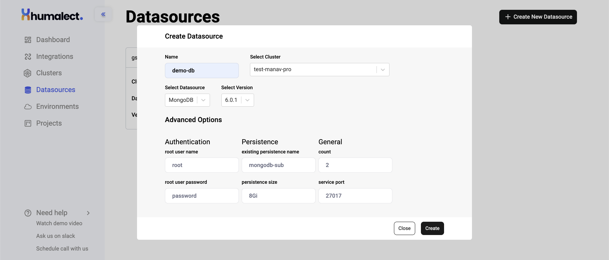

> ## This article covers:-
> 1. Create a MongoDB Datasource
> a. MongoDB Advanced Options
> 2. How to use existing datasources in a pipeline?

Humalect provides several databases that you can integrate and bring your data to the platform, in this article, we will be focusing on **MongoDB**.

MongoDB is a *NoSQL*, document-based database management system. It uses JSON-like documents to store and retrieve data, offering high scalability, flexibility and performance. It also supports indexing, transactions, and rich querying capabilities.

> For more information, see [MongoDB Docs.](https://www.mongodb.com/docs/)

> ## Prerequisite
> *1. have a connected Cloud provider*
> *2. have a connected Source Code provider*
> *3. have a cluster*

## Create a MongoDB Datasource

Let's create a Datasource with `MongoDB version 6.0.1`.

**Step 1:** Go to the DataSources Tab from the UI ([or click here to get redirected](https://console.humalect.com/user/datasources)) and click on `+ Create New Datasource.`
**Step 2:** Enter the following details:

> | Field | Desc |
> | -- | -- |
> | **Name** | name of your Datasource|
> | **Select Cluster** | cluster name where you want your Datasource to be created |
> | **Select DataSource** | choose database/cache of your choice|
> | **Select Version** | `v6.0.1`, `v5.0.10` ([click for more details on MongoDB versions](https://www.mongodb.com/evolved))|

**Step 3:** After you enter the above details, you'll be prompted to enter additional details such as `persistence size`, `service port`, etc. Refer to the below table for more information.

### MongoDB Advanced Options

Under the `Advanced Options`, enter the following details:

| Authentication     | Desc | Persistence               | Desc | General      | Desc |
| ------------------ | ---- | ------------------------- | ---- | ------------ | ---- |
| **root user name**     |      | **existing persistence name** |  If you already have previous persistent volume claim and want to reuse it, you directly attach it using this setting    | **count**        |  Number of replicas   |
| **root user password** |      | **persistence size**          |  This is a measure of size of a MongoDB database and can vary depending on the amount and type of data stored, as well as the configuration of the MongoDB instance.    | **service port** |  The default port for MongoDB is 27017, but it can be configured to listen on a different port using this setting.    |

**Step:4** After you successfully fill in all the required details, click on `Create` and the Datasource creation process will start.

<i>Advanced options available to create mongoDB datasource</i>

**Step 5:** Once the MongoDB Datasource is successfully created, you'll see them listed in the DataSources tab with details like:
		a. Datasource Name
		b. Cluster Name
		c. Database used
		d. Database version used

**Step 6:** If you wish to **delete** the datasource, click on the vertical 3 dots next to the datasource card and click on `Delete`. This will initiate the deletion process.

> **Caution:** *Do not delete any datasource if you are not sure about it as it can lead to data loss.*

## How to use existing datasources in a pipeline?
TBD

> ### Further Reading:
> **1. [DataSources - Postres](https://docs.humalect.com/en/DataSources/Postgres)**
> **2. [DataSources - Redis](https://docs.humalect.com/en/DataSources/Redis)**

### Troubleshooting
Need help? [Contact](https://docs.humalect.com/en/contact) us.
