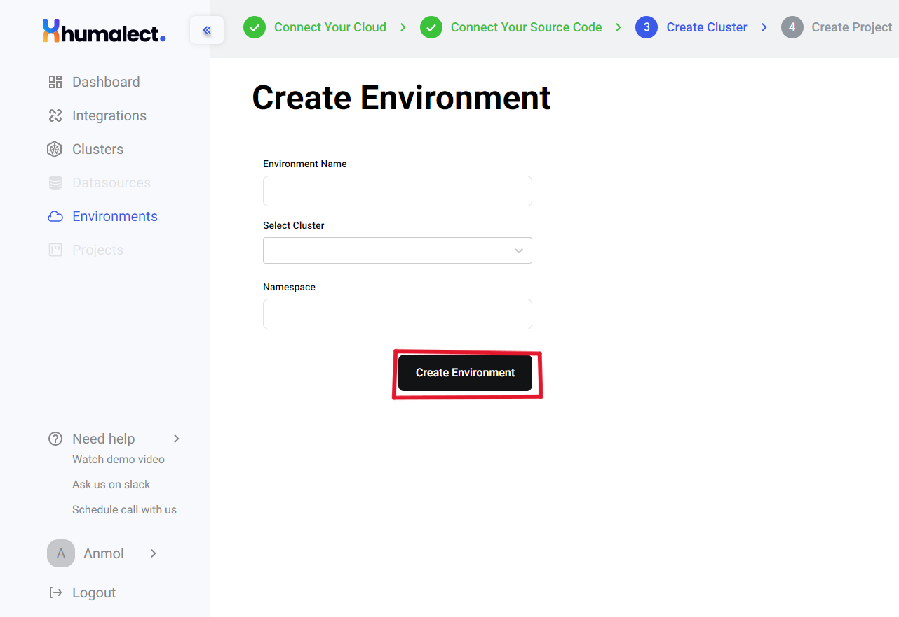

# Creating a new environment
## Environment
An environment refers to a kubernetes namespace that is completely isolated and self contained entity containing multiple application deployments and datasources.

 ## Prerequisites for creating an environment
 1. You should have a running cluster.
 2. You should be authorized to create an environment.

## Create Environment
1. To start creating an environment, go to Humalect's console's `dashboard` -> click on `Environment` -> click on `Create New Environment` button on top right.
After following step 1, you will see this screen:

2. Name the `environment`. Some possible options are dev, staging or prod
3. Select a `cluster` from the drop-down menu. This cluster will be used to host your environment. To know more about clusters, refer to [cluster](https://docs.humalect.com/en/Cluster/Cluster).
4. Write the name of the kubernetes `namespace` inside which you would like to host your environment. if the namespace does not exist already, it will be automatically created for you.

After you have entered all the required necessities mentioned above, click on highlighted `Create Environment` button at the bottom and your environment will be created. Now you can host create multiple pipelines inside this environment post creating projects.

### Troubleshooting
Need help? Contact [Humalect support.](https://humalect.com/)
